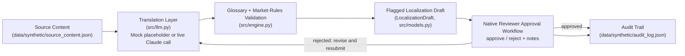

# Global Content Localization Agent

**Cuts the review cycle for launching marketing content into new markets by automatically catching brand-glossary errors and flagging legal/cultural review needs before a human reviewer ever opens the draft.**

## What this demonstrates

- Deterministic, rule-based validation of localized copy against a brand glossary -- catching mistranslated "do not translate" terms and missing required-translation terms without any LLM call.
- Market-specific compliance flagging (e.g. a fictional German advertising-disclosure rule) driven entirely by a data file, so new markets or rules are added without touching code.
- A native-reviewer approval workflow with a persistent, timestamped audit trail -- the human-in-the-loop pattern that keeps an AI-assisted localization pipeline safe to ship from.

## Demo moment

Pick the "Product Launch Email" source asset and generate drafts for Spanish, German, and Japanese. The German draft comes back flagged `requires_legal_review` (this demo's fictional EU-DE Advertising Disclosure Rule, ADR-7) with zero glossary violations, because the brand terms "Northfield Cloud," "Nimbus Sync," and "Premium Plan" were correctly left untranslated and "Free Trial" was correctly rendered as "kostenlose Testversion." Switch to the reviewer panel, play the native-speaker role, and approve or reject the draft with notes -- the audit trail immediately shows the `submitted -> approved` (or `rejected`) transition with a timestamp.

## Architecture



See `docs/architecture.md` for the full component description.

### Translation vs. transcreation vs. legal review vs. native-speaker QA

This demo treats these as four distinct steps, on purpose:

- **Translation** -- converting source text into a target language, term for term. This is all the mock/live draft step does.
- **Transcreation** -- creatively adapting tone, wordplay, and imagery for a target culture. **Not attempted here** -- the demo produces a literal draft only.
- **Legal / regulatory review** -- checking market-specific disclosure or compliance rules (flagged automatically, but the actual review is a human legal step outside this tool).
- **Native-speaker QA** -- a fluent reviewer confirming the draft reads naturally and respects formality/register norms. That's the reviewer panel in `app.py`.

A clean glossary check does not mean a draft is transcreated, legally cleared, or natural-sounding -- each step is independent, and this demo only automates the first and third (partially).

## Quickstart

```bash
pip install -r requirements.txt
streamlit run app.py
```

Runs entirely in mock mode by default, with zero API keys required. **MOCK_MODE draft text is a clearly-labeled placeholder transform, not a real machine translation** -- see the disclaimer below.

## Switching to live mode

```bash
cp .env.example .env
# then edit .env:
#   MOCK_MODE=false
#   ANTHROPIC_API_KEY=sk-ant-...
```

With `MOCK_MODE=false` and a valid `ANTHROPIC_API_KEY`, `src/llm.py` calls Claude (`claude-sonnet-5`) to generate the first-pass localized draft instead of using the deterministic placeholder. The glossary check, market-rule flags, and reviewer workflow all run identically either way.

## Human review, escalation & exceptions

- **Every draft starts `pending`** and requires a human decision (approve or reject) before it can be considered final -- there is no auto-approval path.
- **Glossary violations and market-rule flags are surfaced, not blocking**: a draft with violations or a `requires_legal_review` / `requires_cultural_review` flag can still be reviewed, but the reviewer sees the exact violation text and flag reason before deciding.
- **Rejection requires notes**: the reviewer panel is where a native speaker (or legal/cultural reviewer, in a real deployment) records why a draft didn't pass, creating a record for whoever revises it next.
- **Every transition is audited**: submissions, approvals, and rejections are all appended to `data/synthetic/audit_log.json` with a timestamp, so there's a full history of who decided what, when.

## Evaluation

"Correct" for this agent means:

1. A "do not translate" glossary term (e.g. the brand name) survives verbatim in every target-language draft where it appears in the source.
2. A term with an approved market translation (e.g. "Free Trial") is rendered using that exact approved phrase, not left in English and not paraphrased.
3. Market-rule flags (e.g. `requires_legal_review` for Germany) are attached whenever `market_rules.json` says they should be, and only then.
4. Every approval or rejection is reflected in both the draft's `review_status` and a new, correctly-ordered entry in the audit log.

Run the tests:

```bash
pytest
```

## Roadmap

- **Prototype** (this repo): deterministic glossary/market-rule checks, mock translation drafts, in-session reviewer workflow and audit trail.
- **Pilot**: connect to a real glossary/terminology management system and a live translation memory; route flagged drafts to actual legal/cultural reviewers via email or ticketing instead of an in-app panel.
- **Production controls**: persistent (not session-only) draft storage, role-based access for reviewers, versioned glossary changes, and mandatory legal sign-off gating publication for flagged markets.
- **Rollout & adoption measurement**: track glossary-violation rate over time, average time-to-approval per market, and rejection reasons to identify which markets or asset types need more upfront translation-memory coverage.

## Disclaimer

All source content, brand names, glossary terms, and market rules in this repo are synthetic and fictional, created for portfolio demonstration purposes only. `MOCK_MODE` draft output is a deterministic placeholder transform -- **it is not a real translation and must not be treated as production-quality localization, legal advice, or a substitute for a qualified native-speaker translator or reviewer.**

## License

MIT. See `LICENSE`.
