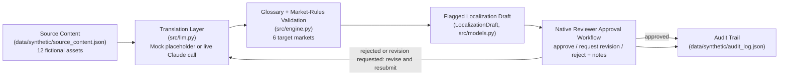

# Global Content Localization Agent

**Maturity:** Streamlit Cloud deployment pending · Synthetic data · Human-review localization workflow

## 1. Business problem

Content-ops teams launching marketing and product copy into new markets
need brand terminology, legal/cultural review requirements, and
native-speaker sign-off checked consistently before a single reviewer ever
opens a draft.

## 2. What the agent does

Given a fictional English source asset and one or more target markets, the
agent produces a first-pass localization draft for each market
(deterministic mock, or optionally live via Claude), checks that draft
against a brand glossary's per-language handling rules, attaches
market-specific legal/cultural review flags from a data-driven rules file,
and routes the draft through a native-reviewer approval workflow (approve /
reject / request revision) with a persistent, timestamped audit trail.

## 3. What this demo is

- A working, testable demonstration of deterministic glossary-compliance
  checking, data-driven market-rule flagging, and a three-outcome
  native-reviewer approval workflow with a persistent, timestamped audit
  trail.
- Runnable end-to-end locally, in mock mode, with zero API keys or external
  services.
- Backed entirely by synthetic, fictional source content, brand terms, and
  market rules -- 12 source assets across varied content types and 6
  target markets, seeded in `data/synthetic/`.
- Public portfolio prototype, synthetic data throughout -- see the banner
  in the running app.

## 4. What this demo is not

- Real authentication or authorization -- there is no login, no user
  accounts, and no access control; the reviewer panel is a UI-level role
  selector anyone running the app can use.
- A live integration with any real translation provider, terminology
  management system, or legal/compliance system -- the only optional live
  call is the Claude draft-generation path in `src/llm.py`.
- Hosted anywhere yet -- there is no deployed URL at the time of this
  release pass (see Deployment, below).
- Production-quality, certified, or legally-reviewed translation output, in
  either mock or live mode. See the Disclaimer at the bottom, and the
  in-app info box next to the draft results.

## 5. Key workflow

1. **Pick a source asset and target market(s).** Choose from 12 fictional
   assets (emails, landing pages, product descriptions, UI microcopy,
   social captions, and more) and any of 6 target markets (Spanish, German,
   Japanese, French, Brazilian Portuguese, Korean).
2. **Generate localized draft(s).** `src/llm.py` produces the draft text
   (mock placeholder by default); `src/engine.py` immediately checks it
   against the brand glossary and attaches market-rule flags.
3. **Review the draft results.** Each draft shows its review status,
   glossary-violation count, and flag count, plus the specific violation
   text and flag reasons.
4. **Play the native reviewer.** Approve, reject, or request revision on
   each pending draft, with notes. A rejected or revision-requested draft
   can be resubmitted for another review pass.
5. **Inspect the audit trail.** Every state transition is appended,
   timestamped, to `data/synthetic/audit_log.json` and shown as a table.
6. **Reset state** whenever you want to return to a clean, empty session.

See `docs/workflow.md` for the full step-by-step flow matching the actual
UI, and `docs/demo-script.md` for a scripted 60-90 second walkthrough.

## 6. Demo metrics and how each is calculated

The in-app metrics panel shows exactly three numbers, each backed directly
by code:

| Metric | Value | How it's calculated |
|---|---|---|
| Source assets | **12** | `len(source_assets)` in `app.py`, where `source_assets` is loaded directly from `data/synthetic/source_content.json` (also asserted in `tests/test_expanded_markets.py::test_exactly_twelve_source_assets_well_formed`). |
| Target markets | **6** | `len(market_rules)` in `app.py`, where `market_rules` is loaded directly from `data/synthetic/market_rules.json` (also asserted in `tests/test_expanded_markets.py::test_exactly_six_target_markets_well_formed`). |
| Localization/review tests | **34** | Hardcoded `VERIFIED_TEST_COUNT = 34` in `app.py`, equal to the literal count of `pytest -v` test cases across `tests/test_engine.py` (12) and `tests/test_expanded_markets.py` (22), verified passing at release time -- see Test and evaluation approach, below. |

Deck metric line: **"12 synthetic source assets · 6 target markets · 34
localization/review tests."**

## 7. Architecture overview



See `docs/architecture.md` for the full component description and
`docs/data-model.md` for the exact record shapes.

## 8. Integration matrix

| Integration | Status | Notes |
|---|---|---|
| LLM narration / draft generation (`src/llm.py`) | `mock` by default, optional `live` | `mock` when `MOCK_MODE=true` (default) -- deterministic, clearly-labeled placeholder, no network call. `live` only when `MOCK_MODE=false` and a valid `ANTHROPIC_API_KEY` is set -- calls Claude (`claude-sonnet-5`) for a first-pass draft, still for human review, not a certified translation. |
| Translation / terminology management system | `mock` | Glossary is a static local JSON file (`data/synthetic/glossary.json`). No live connection to any real TMS or terminology database exists or is planned as a live path in this repo. |
| Market/compliance rules engine | `mock` | Market rules are a static local JSON file (`data/synthetic/market_rules.json`), including fictional advertising/e-commerce disclosure rules. No live connection to a real legal/compliance system. |
| Reviewer routing (email/ticketing) | `planned` | The reviewer panel in `app.py` is an in-app UI role selector only; no real notification, email, or ticketing integration exists yet (see `docs/production-path.md`). |
| Authentication / authorization | `planned` | Not implemented in this prototype; see `docs/limitations.md`. |
| Hosted deployment | `planned` | No hosted demo exists yet -- see Deployment instructions, below. |

## 9. Local setup

```bash
pip install -r requirements.txt
streamlit run app.py
```

Runs entirely in mock mode by default, with zero API keys required.
**MOCK_MODE draft text is a clearly-labeled placeholder transform, not a
real machine translation** -- see the Disclaimer at the bottom.

## 10. Environment variables

Copy `.env.example` to `.env` and edit as needed:

| Variable | Default | Purpose |
|---|---|---|
| `MOCK_MODE` | `true` | When `true`, all draft generation runs on deterministic, rule-based mock data -- no API key, no network calls. Set to `false` to enable live Claude calls. |
| `ANTHROPIC_API_KEY` | (empty) | Only required when `MOCK_MODE=false`. Get a key from https://console.anthropic.com/ |

## 11. Deployment instructions

**Target: Streamlit Community Cloud** (share.streamlit.io).

- Repo: this repository.
- Branch: `main`.
- Main file: `app.py`.
- The default mock-mode deploy requires **no secrets**.
- For live mode, add `ANTHROPIC_API_KEY` (and optionally `MOCK_MODE=false`)
  in Streamlit Cloud's **Secrets** panel for the app, in `.toml` format,
  e.g.:
  ```toml
  ANTHROPIC_API_KEY = "sk-ant-..."
  MOCK_MODE = "false"
  ```

This release pass did not perform any deployment or hosting action --
deploying happens separately once Streamlit Cloud is authenticated by the
repo owner.

## 12. Test and evaluation approach

See `docs/evaluation-plan.md` for the full evaluation plan (what "correct"
means for each component, and how each test checks it).

Run the tests:

```bash
pytest -v
```

**Exact test count at release time: 34 passed** (`tests/test_engine.py`:
12, `tests/test_expanded_markets.py`: 22).

## 13. Accessibility and privacy notes

- Built entirely on Streamlit's native widgets (`st.selectbox`,
  `st.multiselect`, `st.button`, `st.text_area`, `st.metric`,
  `st.dataframe`), all of which are keyboard-operable and screen-reader
  labeled by Streamlit itself.
- Custom focus-order control is limited by what Streamlit exposes --
  this demo does not add any custom ARIA attributes or focus management on
  top of Streamlit's defaults, and does not claim to.
- No PII is collected, stored, or displayed anywhere in this app. All
  source content, glossary terms, market rules, and reviewer notes
  entered during a session are either synthetic seed data or ephemeral,
  session-scoped free text discarded on reset/restart.

## 14. Known limitations

See `docs/limitations.md` for the full list. In short: no auth, no
persistent database beyond the local audit-log file, no real
translation/TMS/legal-system integrations, no reviewer notification
routing, and a fixed set of 12 source assets and 6 target markets.

## 15. Production-readiness roadmap

See `docs/production-path.md` for the full prototype -> pilot ->
production plan, including rollout and adoption measurement.

## 16. Screenshot

Screenshot pending first Streamlit Cloud deploy.

---

## What this demo is / is not, in more detail

### Translation vs. transcreation vs. legal review vs. native-speaker QA

This demo treats these as four distinct steps, on purpose:

- **Translation** -- converting source text into a target language, term
  for term. This is all the mock/live draft step does.
- **Transcreation** -- creatively adapting tone, wordplay, and imagery for
  a target culture. **Not attempted here** -- the demo produces a literal
  draft only.
- **Legal / regulatory review** -- checking market-specific disclosure or
  compliance rules (flagged automatically, but the actual review is a
  human legal step outside this tool).
- **Native-speaker QA** -- a fluent reviewer confirming the draft reads
  naturally and respects formality/register norms. That's the reviewer
  panel in `app.py`.

A clean glossary check does not mean a draft is transcreated, legally
cleared, or natural-sounding -- each step is independent, and this demo
only automates the first and third (partially).

## Human review, escalation & exceptions

- **Every draft starts `pending`** and requires a human decision (approve,
  reject, or request revision) before it can be considered final -- there
  is no auto-approval path.
- **Glossary violations and market-rule flags are surfaced, not
  blocking**: a draft with violations or a `requires_legal_review` /
  `requires_cultural_review` flag can still be reviewed, but the reviewer
  sees the exact violation text and flag reason before deciding.
- **Rejection and revision requests both create a record**: the reviewer
  panel is where a native speaker (or legal/cultural reviewer, in a real
  deployment) records why a draft didn't pass or what needs to change,
  creating a record for whoever revises it next. A rejected or
  revision-requested draft can be resubmitted for another review pass.
- **Every transition is audited**: submissions, approvals, rejections, and
  revision requests are all appended to `data/synthetic/audit_log.json`
  with a timestamp, so there's a full history of who decided what, when.

## Disclaimer

All source content, brand names, glossary terms, and market rules in this
repo are synthetic and fictional, created for portfolio demonstration
purposes only. `MOCK_MODE` draft output is a deterministic placeholder
transform -- **it is not a real translation and must not be treated as
production-quality localization, legal advice, or a substitute for a
qualified native-speaker translator or reviewer.** Localization drafts
produced by this agent, in mock or live mode, do not replace legal,
regulatory, or local-market review -- see the in-app info box next to the
draft results.

## License

MIT. See `LICENSE`.
