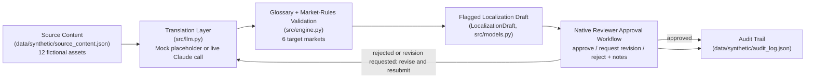

# Architecture

## Components

- **Source content (`data/synthetic/source_content.json`)** -- 12 fictional
  assets spanning varied content types (marketing emails, a landing page
  snippet, a transactional renewal notice, a product description, UI
  microcopy, a social caption, a push notification, an onboarding tooltip,
  a support macro, a blog intro, a webinar invite, and a help-center FAQ
  snippet) in English, each with an id and body text. All names, brands,
  and copy are synthetic and fictional. See `docs/data-model.md` for the
  exact record shape.

- **Translation layer (`src/llm.py`)** -- produces the first-pass localized
  draft text for a source asset + target language.
  - In `MOCK_MODE=true` (default), this is a deterministic, rule-based
    placeholder transform: brand-glossary substitutions are applied
    correctly, and every remaining sentence is tagged `(XX mock)` and the
    whole draft is prefixed with an explicit placeholder banner, so the
    output can never be mistaken for a real translation.
  - In `MOCK_MODE=false` (with `ANTHROPIC_API_KEY` set), the same function
    calls Claude (`claude-sonnet-5`) with the source text and the relevant
    glossary rules as context, and returns a real first-pass draft.

- **Glossary + market-rules validation (`src/engine.py`)** -- the real,
  testable "brain" of the demo:
  - `check_glossary_compliance` scans the source text for every brand
    glossary term (`data/synthetic/glossary.json`) that applies, and
    verifies the target language's handling rule was respected in the
    draft -- either the term survived untranslated (for "do not translate"
    terms) or the market's approved translation phrase is present (for
    terms that must be translated a specific way).
  - `apply_market_flags` reads `data/synthetic/market_rules.json` and
    attaches flags such as `requires_legal_review` (e.g. Germany or South
    Korea, due to fictional advertising/e-commerce disclosure rules) or
    `requires_cultural_review` (e.g. Spain, Japan, Brazil, or South Korea).
    6 target markets are seeded: `es`, `de`, `ja`, `fr`, `pt-BR`, `ko`.

- **Flagged localization draft (`src/models.py`)** -- a `LocalizationDraft`
  dataclass carrying the draft text, glossary violations, flags, and review
  state. Review state is one of `pending`, `approved`, `rejected`, or
  `revision_requested`.

- **Native reviewer approval workflow (`src/engine.py` + `app.py`)** -- a
  human reviewer (played by the demo user) approves, rejects, or requests
  revision on each draft with notes. `revision_requested` is a distinct
  outcome from `rejected`, meant for "close, but needs specific changes."
  A `rejected` or `revision_requested` draft can be resubmitted
  (`submit_for_review`), returning it to `pending`. Every submission,
  approval, rejection, and revision request is a state transition.

- **Audit trail (`data/synthetic/audit_log.json`)** -- created at runtime;
  every state transition is appended with a timestamp, source id, target
  language, action, from/to status, and reviewer notes. The in-app "Reset
  state" button truncates this file back to `[]`.
